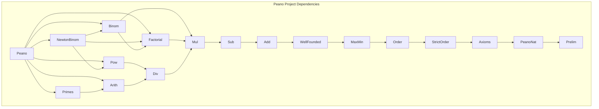

# Dependencias del Proyecto Peano

**Última actualización:** 2026-04-08 22:00
**Autor**: Julián Calderón Almendros

---

## Dependencias de Módulos Lean

Gráfico de dependencias entre los módulos `.lean` del proyecto (cadena principal):

Los módulos residen en `Peano/PeanoNat/` e importan como `Peano.PeanoNat.<Module>`.

**Nota**: Cada módulo también importa directamente los módulos de la cadena base (`PeanoNat`, `Axioms`, etc.) aunque no aparezcan todas las flechas. El gráfico muestra las dependencias directas más relevantes.

---

## Tabla de dependencias por módulo

| Módulo | Ruta | Importa directamente |
|---|---|---|
| `Prelim` | `Peano/Prelim.lean` | `Init.Classical` |
| `PeanoNat` | `Peano/PeanoNat.lean` | `Prelim` |
| `Axioms` | `Peano/PeanoNat/Axioms.lean` | `PeanoNat` |
| `StrictOrder` | `Peano/PeanoNat/StrictOrder.lean` | `PeanoNat`, `Axioms` |
| `Order` | `Peano/PeanoNat/Order.lean` | `…StrictOrder` |
| `MaxMin` | `Peano/PeanoNat/MaxMin.lean` | `…Order` |
| `WellFounded` | `Peano/PeanoNat/WellFounded.lean` | `…MaxMin`, `Init.Classical` |
| `Add` | `Peano/PeanoNat/Add.lean` | `…WellFounded` |
| `Sub` | `Peano/PeanoNat/Sub.lean` | `…Add` |
| `Mul` | `Peano/PeanoNat/Mul.lean` | `…Sub` |
| `Div` | `Peano/PeanoNat/Div.lean` | `…Mul` |
| `Arith` | `Peano/PeanoNat/Arith.lean` | `…Div`, `Init.Classical` |
| `Primes` | `Peano/PeanoNat/Primes.lean` | `…Arith` |
| `Pow` | `Peano/PeanoNat/Pow.lean` | `…Div` |
| `Factorial` | `Peano/PeanoNat/Factorial.lean` | `…Add`, `…Mul` |
| `Binom` | `Peano/PeanoNat/Binom.lean` | `…Factorial`, `…Sub`, `…Mul` |
| `NewtonBinom` | `Peano/PeanoNat/NewtonBinom.lean` | `…Binom`, `…Factorial`, `…Pow` |
| `Decidable` | `Peano/PeanoNat/Decidable.lean` | `…Order` (reexport only) |
| `Isomorph` | `Peano/PeanoNat/Isomorph.lean` | `…Sub` (reexport only) |
| `Peano.lean` | `Peano.lean` | todos los anteriores |
