# Dependencias del Proyecto Peano

**Última actualización:** 2026-07-13 (grafo regenerado por extracción real de
`import` de los 73 módulos de producción — ver `AUDIT-2026-07-13.md` §E)
**Autor**: Julián Calderón Almendros

> **Nota de auditoría (2026-07-13)**: el grafo anterior tenía un nodo raíz `Peano`
> cuyas aristas no se correspondían con lo que `Peano.lean` importa hoy (ya no
> importa cada hoja directamente, importa los barrels temáticos
> `Combinatorics.lean`/`ListsAndSets.lean`/`NumberTheory.lean`/`Foundation.lean`, ver
> ADR-007/§18 de `AI-GUIDE.md`), y contenía dos aristas incorrectas heredadas de una
> versión previa de `Group.lean`: `Group --> Perm` y `Orbit --> Perm` — verificado por
> grep de `import` en disco, `Group.lean` nunca importó `Perm.lean`, y `Orbit.lean`
> importa `Group.lean`, no `Perm.lean`. Ambas corregidas abajo. Grafo generado
> programáticamente a partir de `import Peano.*` real en los 73 ficheros de
> producción — no a mano — para que no vuelva a desincronizarse en silencio.

---

## Dependencias de Módulos Lean

Gráfico de dependencias entre los módulos `.lean` del proyecto.

```mermaid
graph TD;
    subgraph "Peano.lean — barrel raíz (import real, no ficticio)"
        Peano_lean["Peano.lean"] --> Prelim;
        Peano_lean --> PeanoNat;
        Peano_lean --> CoreChain["Axioms→StrictOrder→Order→Tuple→Lattice→WellFounded→Add→Sub→Mul→Div→Arith"];
        Peano_lean --> Fractions;
        Peano_lean --> Primes;
        Peano_lean --> NumberSets;
        Peano_lean --> Isomorph;
        Peano_lean --> Decidable;
        Peano_lean --> Log;
        Peano_lean --> Sqrt;
        Peano_lean --> Digits;
        Peano_lean --> Pairing;
        Peano_lean --> ListsAndSetsBarrel["ListsAndSets.lean (barrel)"];
        Peano_lean --> CombinatoricsBarrel["Combinatorics.lean (barrel)"];
        Peano_lean --> NumberTheoryBarrel["NumberTheory.lean (barrel)"];
        Peano_lean --> FoundationBarrel["Foundation/Foundation.lean (barrel)"];
    end

    subgraph "ListsAndSets/ — via barrel"
        ListsAndSetsBarrel --> List;
        ListsAndSetsBarrel --> FSet;
        ListsAndSetsBarrel --> FSetFunction;
        ListsAndSetsBarrel --> EquivRel;
        FSet --> List;
        FSetFunction --> FSet;
        FSetFunction --> List;
        EquivRel --> FSet;
        List --> Arith;
    end

    subgraph "NumberTheory/ — via barrel"
        NumberTheoryBarrel --> ModEq;
        NumberTheoryBarrel --> Totient;
        NumberTheoryBarrel --> ChineseRemainder;
        NumberTheoryBarrel --> Fermat;
        NumberTheoryBarrel --> Wilson;
        ModEq --> Div;
        ModEq --> Arith;
        Totient --> NumberSets;
        Totient --> ModEq;
        ChineseRemainder --> ModEq;
        ChineseRemainder --> Arith;
        Fermat --> Totient;
        Fermat --> ModEq;
        Wilson --> Fermat;
        Wilson --> ModEq;
        Wilson --> Primes;
        NumberSets --> FSet;
    end

    subgraph "Combinatorics/ — via barrel"
        CombinatoricsBarrel --> Pow;
        CombinatoricsBarrel --> Factorial;
        CombinatoricsBarrel --> Binom;
        CombinatoricsBarrel --> NewtonBinom;
        CombinatoricsBarrel --> Summation;
        CombinatoricsBarrel --> Product;
        CombinatoricsBarrel --> Fibonacci;
        CombinatoricsBarrel --> Counting;
        CombinatoricsBarrel --> Perm;
        CombinatoricsBarrel --> Sign;
        CombinatoricsBarrel --> Orbit;
        CombinatoricsBarrel --> Group;
        CombinatoricsBarrel --> Action;
        CombinatoricsBarrel --> NormalSubgroup;
        CombinatoricsBarrel --> QuotientGroup;
        CombinatoricsBarrel --> FirstIsomorphism;
        CombinatoricsBarrel --> SecondIsomorphism;
        CombinatoricsBarrel --> ThirdIsomorphism;
        CombinatoricsBarrel --> CorrespondenceTheorem;
        CombinatoricsBarrel --> Zassenhaus;
        CombinatoricsBarrel --> Cosets;
        CombinatoricsBarrel --> CosetAction;
        CombinatoricsBarrel --> Sylow;

        NewtonBinom --> Binom;
        NewtonBinom --> Factorial;
        NewtonBinom --> Pow;
        NewtonBinom --> Summation;
        Binom --> Factorial;
        Binom --> Mul;
        Binom --> Primes;
        Binom --> ModEq;
        Factorial --> Mul;
        Summation --> Add;
        Product --> Mul;
        Product --> FSet;
        Fibonacci --> Add;
        Pow --> Div;
        Counting --> FSet;
        Perm --> FSetFunction;
        Perm --> List;
        Sign --> Perm;
        Orbit --> Group;
        Group --> FSet;
        Group --> FSetFunction;
        Action --> Group;
        Action --> Cosets;
        Action --> NormalSubgroup;
        Cosets --> Group;
        CosetAction --> Cosets;
        CosetAction --> Action;
        CosetAction --> Group;
        NormalSubgroup --> Group;
        NormalSubgroup --> Cosets;
        QuotientGroup --> NormalSubgroup;
        QuotientGroup --> Cosets;
        FirstIsomorphism --> QuotientGroup;
        SecondIsomorphism --> FirstIsomorphism;
        ThirdIsomorphism --> QuotientGroup;
        CorrespondenceTheorem --> QuotientGroup;
        Zassenhaus --> SecondIsomorphism;
        Sylow --> Cosets;
        Sylow --> CosetAction;
        Sylow --> Action;
        Sylow --> NormalSubgroup;
        Sylow --> QuotientGroup;
        Sylow --> CorrespondenceTheorem;
    end

    subgraph "Foundation/ — via barrel"
        FoundationBarrel --> PeanoSystem;
        FoundationBarrel --> Initiality;
        FoundationBarrel --> PureAxioms;
        FoundationBarrel --> CantorPairing;
        FoundationBarrel --> GodelBeta;
        Initiality --> PeanoSystem;
        Initiality --> PrelimClassical["Prelim.Classical"];
        PureAxioms --> PeanoSystem;
        PureAxioms --> Initiality;
        PureAxioms --> PrelimClassical;
        CantorPairing --> Arith;
        CantorPairing --> Sqrt;
        GodelBeta --> CantorPairing;
        GodelBeta --> ChineseRemainder;
        GodelBeta --> Factorial;
    end

    subgraph "Núcleo aritmético (cadena lineal, colapsada arriba en CoreChain)"
        Primes --> Arith;
        Arith --> Div;
        Fractions --> Arith;
        Fractions --> Lattice;
        Isomorph --> Arith;
        Digits --> Log;
        Log --> Pow;
        Sqrt --> Pow;
        Pairing --> Sqrt;
        Div --> Mul;
        Mul --> Sub;
        Sub --> Add;
        Add --> WellFounded;
        WellFounded --> Lattice;
        Lattice --> Order;
        Tuple --> StrictOrder;
        Order --> StrictOrder;
        StrictOrder --> Axioms;
        Axioms --> PeanoNat;
        PeanoNat --> Prelim;
        Decidable --> Order;
    end

    subgraph "Prelim/"
        Prelim --> ExistsUnique;
        Prelim --> PrelimClassical;
        PrelimClassical --> ExistsUnique;
    end
```

Los módulos residen en `Peano/PeanoNat/` e importan como `Peano.PeanoNat.<Module>`.

**Nota**: grafo generado por extracción real de `import Peano.*` de los 73 ficheros de
producción (2026-07-13) — no es curado a mano. Cada módulo también importa
directamente algunos módulos de la cadena base (`PeanoNat`, `Axioms`, etc.) aunque no
aparezcan todas esas flechas de más bajo nivel — se colapsan en el nodo `CoreChain`
para legibilidad. `GroupTheory.lean` y `GroupTheory/Sylow.lean` existen como barrels
en disco (§18 de `AI-GUIDE.md`) pero `Combinatorics.lean` los bypasea e importa cada
hoja de `GroupTheory/` directamente — candidato de limpieza futura, no urgente.

---

## Tabla de dependencias por módulo

| Módulo | Ruta | Importa directamente |
|---|---|---|
| `ExistsUnique` | `Peano/Prelim/ExistsUnique.lean` | (ninguno) |
| `Classical` | `Peano/Prelim/Classical.lean` | `Init.Classical`, `ExistsUnique` |
| `Prelim` | `Peano/Prelim.lean` | `ExistsUnique`, `Classical` |
| `PeanoNat` | `Peano/PeanoNat.lean` | `Prelim` |
| `Axioms` | `Peano/PeanoNat/Axioms.lean` | `PeanoNat` |
| `StrictOrder` | `Peano/PeanoNat/StrictOrder.lean` | `PeanoNat`, `Axioms` |
| `Order` | `Peano/PeanoNat/Order.lean` | `…StrictOrder` |
| `Tuple` | `Peano/PeanoNat/Tuple.lean` | `PeanoNat`, `StrictOrder` |
| `Lattice` | `Peano/PeanoNat/Lattice.lean` | `…Order` |
| `WellFounded` | `Peano/PeanoNat/WellFounded.lean` | `…Lattice`, `Init.Classical` |
| `Add` | `Peano/PeanoNat/Add.lean` | `…WellFounded` |
| `Sub` | `Peano/PeanoNat/Sub.lean` | `…Add` |
| `Mul` | `Peano/PeanoNat/Mul.lean` | `…Sub` |
| `Div` | `Peano/PeanoNat/Div.lean` | `…Mul` |
| `Arith` | `Peano/PeanoNat/Arith.lean` | `…Div`, `Init.Classical` |
| `Primes` | `Peano/PeanoNat/Primes.lean` | `…Arith` |
| `NumberSets` | `Peano/PeanoNat/NumberSets.lean` | `…FSet`, `…Arith` |
| `Pow` | `Combinatorics/Pow.lean` | `…Div` |
| `Factorial` | `Combinatorics/Factorial.lean` | `…Add`, `…Mul` |
| `Binom` | `Combinatorics/Binom.lean` | `…Factorial`, `…Sub`, `…Mul` |
| `Summation` | `Combinatorics/Summation.lean` | `…Add` |
| `Product` | `Combinatorics/Product.lean` | `…Mul` |
| `Fibonacci` | `Combinatorics/Fibonacci.lean` | `…Add` |
| `NewtonBinom` | `Combinatorics/NewtonBinom.lean` | `…Binom`, `…Pow`, `…Summation` |
| `Counting` | `Combinatorics/Counting.lean` | `…FSet` (stub, sin API) |
| `Perm` | `Combinatorics/Perm.lean` | `…FSet`, `…FSetFunction`, `…List` |
| `Sign` | `Combinatorics/Sign.lean` | `…Perm` (stub, sin API) |
| `Orbit` | `Combinatorics/Orbit.lean` | `…Group` (stub, sin API — **no** `…Perm`, corregido 2026-07-13) |
| `Group` | `Combinatorics/Group.lean` | `…FSet`, `…FSetFunction` (**no** `…Perm`, corregido 2026-07-13) |
| `Action` | `GroupTheory/Action.lean` | `…Group`, `…Cosets`, `…NormalSubgroup` |
| `NormalSubgroup` | `GroupTheory/NormalSubgroup.lean` | `…Group`, `…Cosets` |
| `QuotientGroup` | `GroupTheory/QuotientGroup.lean` | `…NormalSubgroup`, `…Cosets` |
| `FirstIsomorphism` | `GroupTheory/FirstIsomorphism.lean` | `…QuotientGroup` |
| `SecondIsomorphism` | `GroupTheory/SecondIsomorphism.lean` | `…FirstIsomorphism` |
| `CorrespondenceTheorem` | `GroupTheory/CorrespondenceTheorem.lean` | `…QuotientGroup` |
| `ThirdIsomorphism` | `GroupTheory/ThirdIsomorphism.lean` | `…QuotientGroup` |
| `Zassenhaus` | `GroupTheory/Zassenhaus.lean` | `…SecondIsomorphism` |
| `Cosets` | `GroupTheory/Sylow/Cosets.lean` | `…Group` |
| `CosetAction` | `GroupTheory/Sylow/CosetAction.lean` | `…Cosets`, `…Action`, `…Group` |
| `Sylow` | `GroupTheory/Sylow/Sylow.lean` | `…Cosets`, `…CosetAction`, `…Action`, `…NormalSubgroup`, `…QuotientGroup`, `…CorrespondenceTheorem` |
| `List` | `ListsAndSets/List.lean` | `…Arith` |
| `FSet` | `ListsAndSets/FSet.lean` | `…List` |
| `EquivRel` | `ListsAndSets/EquivRel.lean` | `…FSet` |
| `FSetFunction` | `ListsAndSets/FSetFunction.lean` | `…FSet`, `…List` |
| `Fractions` | `PeanoNat/Fractions.lean` | `…Arith`, `…Lattice` |
| `ModEq` | `NumberTheory/ModEq.lean` | `…Div`, `…Arith` |
| `Totient` | `NumberTheory/Totient.lean` | `…NumberSets`, `…ModEq` |
| `ChineseRemainder` | `NumberTheory/ChineseRemainder.lean` | `…ModEq`, `…Arith` |
| `Fermat` | `NumberTheory/Fermat.lean` | `…Totient`, `…ModEq` |
| `Wilson` | `NumberTheory/Wilson.lean` | `…Fermat`, `…ModEq`, `…Primes` |
| `Log` | `PeanoNat/Log.lean` | `…Div`, `…Pow` |
| `Sqrt` | `PeanoNat/Sqrt.lean` | `…Mul`, `…Sub`, `…Pow` |
| `Digits` | `PeanoNat/Digits.lean` | `…Log` |
| `Pairing` | `PeanoNat/Pairing.lean` | `…Sqrt` |
| `Decidable` | `PeanoNat/Decidable.lean` | `…Order` (reexport) |
| `Isomorph` | `PeanoNat/Isomorph.lean` | `…Arith` (reexport) |
| `CantorPairing` | `Foundation/CantorPairing.lean` | `…Arith`, `…Sqrt` |
| `GodelBeta` | `Foundation/GodelBeta.lean` | `…CantorPairing`, `…ChineseRemainder`, `…Factorial` |
| `PeanoSystem` | `Foundation/PeanoSystem.lean` | `PeanoNat` |
| `Initiality` | `Foundation/Initiality.lean` | `…PeanoSystem`, `Prelim.Classical` |
| `PureAxioms` | `Foundation/PureAxioms.lean` | `…PeanoSystem`, `…Initiality`, `Prelim.Classical` |
| `Foundation` (barrel) | `Foundation/Foundation.lean` | `…PeanoSystem`, `…Initiality`, `…PureAxioms`, `…CantorPairing`, `…GodelBeta` |
| `ListsAndSets` (barrel) | `PeanoNat/ListsAndSets.lean` | `…List`, `…FSet`, `…FSetFunction`, `…EquivRel` |
| `Combinatorics` (barrel) | `PeanoNat/Combinatorics.lean` | los 22 ficheros de `Combinatorics/` y `Combinatorics/GroupTheory/` (hojas directas, ver nota bajo el grafo) |
| `NumberTheory` (barrel) | `PeanoNat/NumberTheory.lean` | `…ModEq`, `…Totient`, `…ChineseRemainder`, `…Fermat`, `…Wilson` |
| `GroupTheory` (barrel, huérfano) | `Combinatorics/GroupTheory.lean` | existe en disco pero no está en la cadena de imports real desde `Peano.lean` (ver nota bajo el grafo) |
| `Sylow` (barrel, huérfano) | `Combinatorics/GroupTheory/Sylow.lean` | ídem |
| `Peano.lean` | `Peano.lean` | `Prelim`, `PeanoNat`, cadena aritmética base, `Fractions`, `Primes`, `NumberSets`, `Isomorph`, `Decidable`, `Log`, `Sqrt`, `Digits`, `Pairing`, y los 4 barrels temáticos (`ListsAndSets`, `Combinatorics`, `NumberTheory`, `Foundation`) |

<!-- AUTO-UPDATE-2026-07-13-START -->
## Actualización de estado — 2026-07-13

- Build: 73 jobs, 0 sorry, 0 axiomas privados no intencionales (los 6 de
  `PureAxioms.lean` son intencionales). 0 errores. Lean 4.31.0.
- Grafo regenerado por extracción real de `import` (ya no a mano) — ver
  `AUDIT-2026-07-13.md` §E para el detalle de qué se corrigió.
- Añadidos al grafo/tabla: `Wilson`, `CosetAction`, `CantorPairing`, `GodelBeta`,
  `PeanoSystem`, `Initiality`, `PureAxioms`, y los 4 barrels temáticos reales
  (`ListsAndSets.lean`, `Combinatorics.lean`, `NumberTheory.lean`,
  `Foundation/Foundation.lean`).
- Corregidas 2 aristas erróneas heredadas: `Group --> Perm` y `Orbit --> Perm`
  (ninguna de las dos existe en el código; `Orbit` depende de `Group`, `Group` no
  depende de `Perm`).

<!-- AUTO-UPDATE-2026-07-13-END -->
