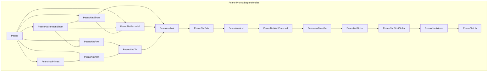

# Dependencias del Proyecto Peano

**Última actualización:** 2026-03-15 12:00
**Autor**: Julián Calderón Almendros

---

## Dependencias de Módulos Lean

Gráfico de dependencias entre los módulos `.lean` del proyecto (cadena principal):

**Nota**: Cada módulo también importa directamente los módulos de la cadena base (`PeanoNatLib`, `PeanoNatAxioms`, etc.) aunque no aparezcan todas las flechas. El gráfico muestra las dependencias directas más relevantes.

---

## Tabla de dependencias por módulo

| Módulo | Importa directamente |
|---|---|
| `PeanoNatLib` | `Init.Classical` |
| `PeanoNatAxioms` | `PeanoNatLib` |
| `PeanoNatStrictOrder` | `PeanoNatLib`, `PeanoNatAxioms` |
| `PeanoNatOrder` | `…StrictOrder` |
| `PeanoNatMaxMin` | `…Order` |
| `PeanoNatWellFounded` | `…MaxMin`, `Init.Classical` |
| `PeanoNatAdd` | `…WellFounded` |
| `PeanoNatSub` | `…Add` |
| `PeanoNatMul` | `…Sub` |
| `PeanoNatDiv` | `…Mul` |
| `PeanoNatArith` | `…Div`, `Init.Classical` |
| `PeanoNatPrimes` | `…Arith` |
| `PeanoNatPow` | `…Div` |
| `PeanoNatFactorial` | `…Add`, `…Mul` |
| `PeanoNatBinom` | `…Factorial`, `…Sub`, `…Mul` |
| `PeanoNatNewtonBinom` | `…Binom`, `…Factorial`, `…Pow` |
| `Peano.lean` | todos los anteriores |
