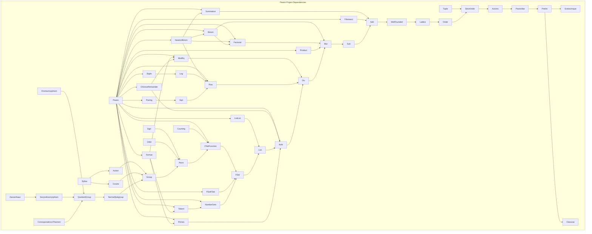

# Dependencias del Proyecto Peano

**Última actualización:** 2026-05-10
**Autor**: Julián Calderón Almendros

---

## Dependencias de Módulos Lean

Gráfico de dependencias entre los módulos `.lean` del proyecto.

Los módulos residen en `Peano/PeanoNat/` e importan como `Peano.PeanoNat.<Module>`.

**Nota**: Cada módulo también importa directamente los módulos de la cadena base (`PeanoNat`, `Axioms`, etc.) aunque no aparezcan todas las flechas. El gráfico muestra las dependencias directas más relevantes.

---

## Tabla de dependencias por módulo

| Módulo | Ruta | Importa directamente |
|---|---|---|
| `ExistsUnique` | `Peano/Prelim/ExistsUnique.lean` | (ninguno) |
| `Classical` | `Peano/Prelim/Classical.lean` | `Init.Classical`, `ExistsUnique` |
| `Prelim` | `Peano/Prelim.lean` | `ExistsUnique`, `Classical` |
| `PeanoNat` | `Peano/PeanoNat.lean` | `Prelim` |
| `Axioms` | `Peano/PeanoNat/Axioms.lean` | `PeanoNat` |
| `StrictOrder` | `Peano/PeanoNat/StrictOrder.lean` | `PeanoNat`, `Axioms` |
| `Order` | `Peano/PeanoNat/Order.lean` | `…StrictOrder` |
| `Tuple` | `Peano/PeanoNat/Tuple.lean` | `PeanoNat`, `StrictOrder` |
| `Lattice` | `Peano/PeanoNat/Lattice.lean` | `…Order` |
| `WellFounded` | `Peano/PeanoNat/WellFounded.lean` | `…Lattice`, `Init.Classical` |
| `Add` | `Peano/PeanoNat/Add.lean` | `…WellFounded` |
| `Sub` | `Peano/PeanoNat/Sub.lean` | `…Add` |
| `Mul` | `Peano/PeanoNat/Mul.lean` | `…Sub` |
| `Div` | `Peano/PeanoNat/Div.lean` | `…Mul` |
| `Arith` | `Peano/PeanoNat/Arith.lean` | `…Div`, `Init.Classical` |
| `Primes` | `Peano/PeanoNat/Primes.lean` | `…Arith` |
| `NumberSets` | `Peano/PeanoNat/NumberSets.lean` | `…FSet`, `…Arith` |
| `Pow` | `Combinatorics/Pow.lean` | `…Div` |
| `Factorial` | `Combinatorics/Factorial.lean` | `…Add`, `…Mul` |
| `Binom` | `Combinatorics/Binom.lean` | `…Factorial`, `…Sub`, `…Mul` |
| `Summation` | `Combinatorics/Summation.lean` | `…Add` |
| `Product` | `Combinatorics/Product.lean` | `…Mul` |
| `Fibonacci` | `Combinatorics/Fibonacci.lean` | `…Add` |
| `NewtonBinom` | `Combinatorics/NewtonBinom.lean` | `…Binom`, `…Pow`, `…Summation` |
| `Counting` | `Combinatorics/Counting.lean` | `…FSetFunction` |
| `Perm` | `Combinatorics/Perm.lean` | `…FSetFunction` |
| `Sign` | `Combinatorics/Sign.lean` | `…Perm` |
| `Orbit` | `Combinatorics/Orbit.lean` | `…Perm` |
| `Group` | `Combinatorics/Group.lean` | `…Perm` |
| `Action` | `GroupTheory/Action.lean` | `…Group` |
| `NormalSubgroup` | `GroupTheory/NormalSubgroup.lean` | `…Group` |
| `QuotientGroup` | `GroupTheory/QuotientGroup.lean` | `…NormalSubgroup` |
| `FirstIsomorphism` | `GroupTheory/FirstIsomorphism.lean` | `…QuotientGroup` |
| `SecondIsomorphism` | `GroupTheory/SecondIsomorphism.lean` | `…QuotientGroup` |
| `CorrespondenceTheorem` | `GroupTheory/CorrespondenceTheorem.lean` | `…QuotientGroup` |
| `Zassenhaus` | `GroupTheory/Zassenhaus.lean` | `…SecondIsomorphism` |
| `Cosets` | `GroupTheory/Sylow/Cosets.lean` | `…Group` |
| `Sylow` | `GroupTheory/Sylow/Sylow.lean` | `…Cosets`, `…Action` |
| `List` | `ListsAndSets/List.lean` | `…Arith` |
| `ListList` | `ListsAndSets/ListList.lean` | `…List` |
| `FSet` | `ListsAndSets/FSet.lean` | `…List` |
| `FSetFSet` | `ListsAndSets/FSetFSet.lean` | `…FSet` |
| `FSetFunction` | `ListsAndSets/FSetFunction.lean` | `…FSet` |
| `ModEq` | `NumberTheory/ModEq.lean` | `…Div` |
| `Totient` | `NumberTheory/Totient.lean` | `…NumberSets` |
| `ChineseRemainder` | `NumberTheory/ChineseRemainder.lean` | `…ModEq`, `…Arith` |
| `Fermat` | `NumberTheory/Fermat.lean` | `…Totient`, `…ModEq`, `…Primes` |
| `Log` | `PeanoNat/Log.lean` | `…Div`, `…Pow` |
| `Sqrt` | `PeanoNat/Sqrt.lean` | `…Mul`, `…Sub`, `…Pow` |
| `Digits` | `PeanoNat/Digits.lean` | `…Log` |
| `Pairing` | `PeanoNat/Pairing.lean` | `…Sqrt` |
| `Decidable` | `PeanoNat/Decidable.lean` | `…Order` (reexport) |
| `Isomorph` | `PeanoNat/Isomorph.lean` | `…Sub` (reexport) |
| `Peano.lean` | `Peano.lean` | todos los anteriores |

<!-- AUTO-UPDATE-2026-05-10-START -->
## Actualizacion de estado - 2026-05-10

- Build: 66 jobs, 0 sorry, 3 axiomas privados (Sylow.lean). 0 errores.
- **Zassenhaus.lean** añadido: importa `SecondIsomorphism`. 12 exports públicos.
- Creado directorio `doc/` con `REFERENCE-GroupTheory.md`.
- Modúlos GroupTheory añadidos al grafo: NormalSubgroup, QuotientGroup,
  FirstIsomorphism, SecondIsomorphism, CorrespondenceTheorem, Zassenhaus.

<!-- AUTO-UPDATE-2026-05-10-END -->
