# Dependencias del Proyecto Peano

**Última actualización:** 2026-02-28 12:00
**Autor**: Julián Calderón Almendros

---

## Dependencias de Módulos Lean

Esta sección contiene un gráfico de las dependencias entre los módulos `.lean` del proyecto.

```mermaid
graph TD;
    subgraph Peano Project Dependencies
        Peano --> PeanoNatArith;
        PeanoNatArith --> PeanoNatDiv;
        PeanoNatDiv --> PeanoNatMul;
        PeanoNatMul --> PeanoNatSub;
        PeanoNatSub --> PeanoNatAdd;
        PeanoNatAdd --> PeanoNatWellFounded;
        PeanoNatWellFounded --> PeanoNatMaxMin;
        PeanoNatMaxMin --> PeanoNatOrder;
        PeanoNatOrder --> PeanoNatStrictOrder;
        PeanoNatStrictOrder --> PeanoNatAxioms;
        PeanoNatAxioms --> PeanoNatLib;
    end
```

**Nota**: Este gráfico muestra una vista simplificada de la jerarquía principal de dependencias. Las dependencias reales son más complejas, ya que cada módulo importa a varios otros que no están directamente debajo de él en esta cadena.

